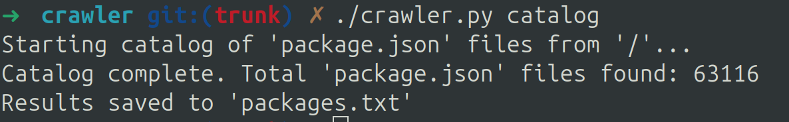
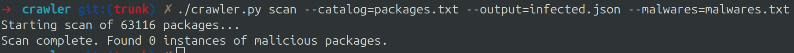

# NPM Malware Scanner

A Python tool for scanning Node.js projects to detect malicious packages in dependencies.

Note: Malware list needs to be supplied by the user. Repo includes a default list of malware packages

UNDER DEVELOPMENT - USE AT YOUR OWN RISK

## Screenshots

### Catalog Mode


### Scan Mode


## Features

- Catalog all `package.json` files on the filesystem
- Scan projects for user supplied malicious packages list
- Support for both specific versions and "all versions" malware detection
- Basic reporting with package locations
- Fast enough for system-wide scans

## Installation

No additional dependencies required beyond Python 3.10+ standard library.

## Usage

### Catalog Mode

Find all `package.json` files on the system:

```bash
./crawler.py catalog [options]
# or
python3 crawler.py catalog [options]
```

Options:
- `--output FILE`: Output file for package.json paths (default: packages.txt)
- `--path PATH`: Starting path for filesystem scan (default: /)

Example:
```bash
./crawler.py catalog --output my_packages.txt --path /home/user/projects
# or
python3 crawler.py catalog --output my_packages.txt --path /home/user/projects
```

### Scan Mode

Scan projects for malicious packages:

```bash
./crawler.py scan [options]
# or
python3 crawler.py scan [options]
```

Required arguments:
- `--catalog FILE`: File containing package.json paths to scan
- `--malwares FILE`: File listing malicious packages

Optional arguments:
- `--output FILE`: File to save scan findings (JSON format, defaults to stdout)

Example:
```bash
./crawler.py scan --catalog packages.txt --malwares malwares.txt --output results.json
# or
python3 crawler.py scan --catalog packages.txt --malwares malwares.txt --output results.json
```

## Malware Database Format

The malware packages file should contain one package per line:

```
# All versions of this package are malicious
malicious-package

# Only specific versions are malicious
another-package@1.2.3
bad-package@2.0.0

# Scoped packages are supported
@scope/malicious-package@1.0.0
```

## Output Format

### Catalog Mode
Outputs a simple text file with one package.json path per line.

### Scan Mode
When malware is detected, displays:
```
--- 🚨 MALWARE DETECTED ---
Package: malicious-package@1.2.3
Location: /path/to/node_modules/malicious-package
```

JSON output contains detailed information:
```json
{
    "project_package_json": "/path/to/project/package.json",
    "node_modules_path": "/path/to/node_modules",
    "malicious_package": "malicious-package",
    "found_version": "1.2.3"
}
```

## Workflow

1. **Catalog**: Find all package.json files
   ```bash
   ./crawler.py catalog --output packages.txt
   # or
   python3 crawler.py catalog --output packages.txt
   ```

2. **Scan**: Check for malicious packages
   ```bash
   ./crawler.py scan --catalog packages.txt --malwares malwares.txt
   # or
   python3 crawler.py scan --catalog packages.txt --malwares malwares.txt
   ```

3. **Review**: Check the output for detected malware and take appropriate action

## Examples

### Basic scan of current directory
```bash
./crawler.py catalog --path . --output local_packages.txt
./crawler.py scan --catalog local_packages.txt --malwares malwares.txt
# or
python3 crawler.py catalog --path . --output local_packages.txt
python3 crawler.py scan --catalog local_packages.txt --malwares malwares.txt
```

### System-wide scan

Note: Default catalog starts from /, recursively.

```bash
sudo ./crawler.py catalog --output system_packages.txt
sudo ./crawler.py scan --catalog system_packages.txt --malwares malwares.txt --output scan_results.json
# or
sudo python3 crawler.py catalog --output system_packages.txt
sudo python3 crawler.py scan --catalog system_packages.txt --malwares malwares.txt --output scan_results.json
```

### Testing

Unit tests can be run using:

```bash
pytest test_crawler.py
```

### License

This project is licensed under the MIT License.